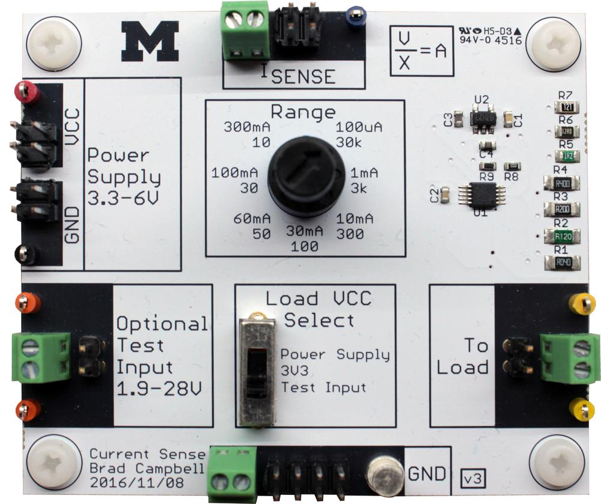

CurrentSense
============

CurrentSense is a tool for measuring current in embedded systems.

Usage
-----

Description of the inputs:

- **Power Supply**: 3.3-6 volts that supplies power to the measurement circuitry.
- **Optional Test Input**: This input can be used to power the load under test.
This is particularly useful for energy-harvesting or other systems where the input
power is not stable.
- **I_Sense**: The measurable output signal that is proportional to current.
To calculate current, divide the I_Sense signal (in volts) by the number
that corresponds to the selected range value. This will return the current
in amps.
- **Range**: Select the maximum current you want to measure. Select this as
close to the maximum you wish to measure as possible.
- **Load VCC Select**: This selects how you would like to power the load under
test. The options
  - Power Supply: Use the input from the power supply that is powering the
  measurement circuitry to also power the load.
  - 3V3: Use the onboard regulated 3.3 V rail to power the load.
  - Test Input: Use the external test input to power the load.
- **To Load**: Connect to VCC or the signal you wish to measure.
- **GND**: A set of ground pins for convenience.

Errata
------

The 300 mA range doesn't seem to work on v3.
